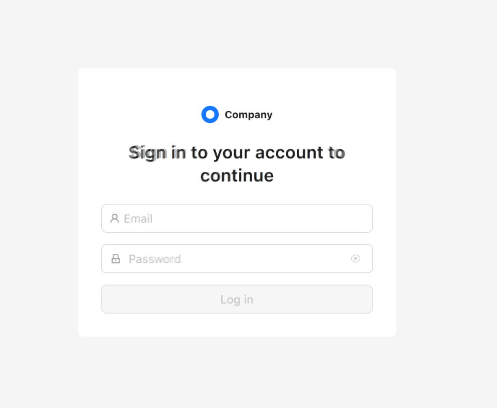
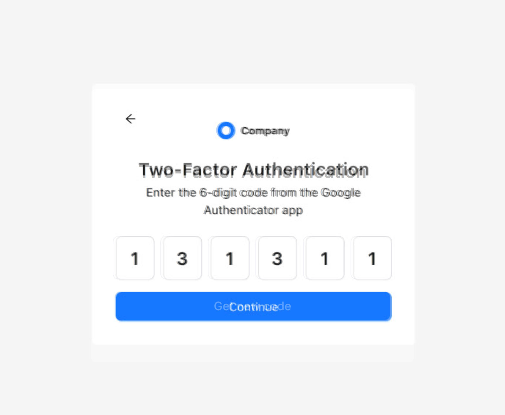
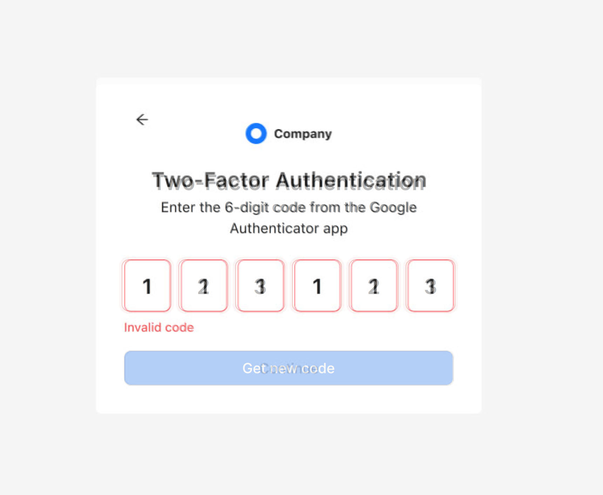

🔐 Проект: Система аутентификации с 2FA

Демонстрационный проект экрана авторизации с поддержкой двухфакторной аутентификации (2FA), реализованный на React и TypeScript.

📄 Техническое задание

Необходимо разработать экран авторизации с поддержкой 2FA и предусмотреть все возможные состояния и ошибки API.
Для эмуляции API использованы моки, реализованные через TanStack Query (React Query).

В задании не требовалось использовать Storybook или Zod — решение выполнено в базовом, но полном функциональном варианте.

🚀 Быстрый старт

Для тестирования доступны заранее подготовленные учетные записи:

✅ Аккаунт с включённой 2FA
Email: user@example.com

👤 Аккаунт без 2FA
Email: no2fa@example.com

🔒 Аккаунт заблокирован
Email: locked@account.com

📧 Email не подтверждён
Email: unverified@email.com

-

Пароль: 123456
Код 2FA: 123456

📋 Функциональные возможности

✅ Экран авторизации с обработкой всех состояний
✅ Поддержка двухфакторной аутентификации (2FA)
✅ Обработка ошибок API через моки
✅ Pixel Perfect верстка по макету из Figma
✅ Полноценная имитация backend-логики

🛠 Технологический стек
Технология Назначение
React построение UI-компонентов
TypeScript строгая типизация
TanStack Query работа с асинхронными запросами и моками API
CSS / SCSS / Module CSS стилизация и Pixel Perfect-верстка
Vite / Firebase Hosting сборка и деплой проекта

